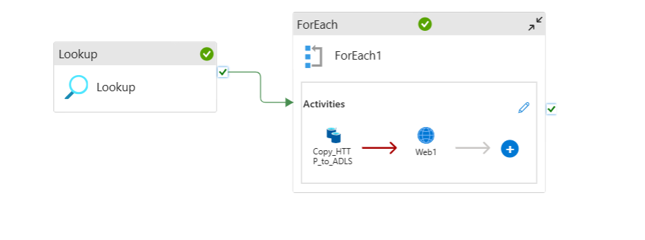
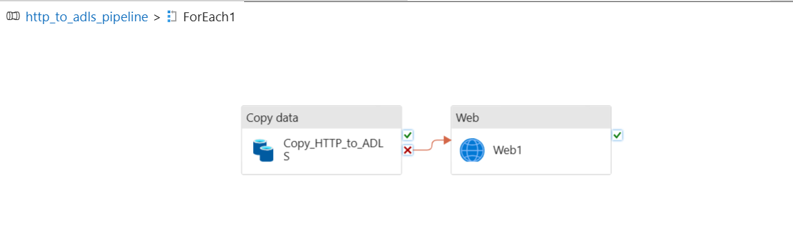

# Azure Data Factory: Metadata-Driven HTTP to ADLS Ingestion

## Overview

This project automates the ingestion of multiple CSV files from HTTP sources to Azure Data Lake Storage Gen2 (ADLS) using Azure Data Factory (ADF). The pipeline is metadata-driven, scalable, and includes error handling with notifications via Azure Logic Apps.

---

## Features

- **Metadata-driven ingestion:** Uses a JSON file to define source and destination for each file.
- **Parameterized datasets and pipeline:** Enables dynamic file ingestion with a single pipeline.
- **Automated scheduling:** Pipeline can be triggered on a schedule.
- **Error handling:** On failure, sends notifications via Logic App and email.
- **Best practices:** Secure, maintainable, and ready for production.

---

## Ingested Files

- `Cases_deaths.csv`
- `Hospital_admissions.csv`
- `Testing.csv`

---

## Architecture

1. **Lookup Activity:** Reads metadata JSON from ADLS.
2. **ForEach Activity:** Iterates over each file entry in the metadata.
3. **Copy Activity:** Copies data from HTTP to ADLS, parameterized by metadata.
4. **Web Activity (on failure):** Sends error details to Logic App for email notification.

---
## Architecture Diagram




## Folder Structure

```
factory/
├── datasets/
│   ├── ds_http_covid_data.json
│   ├── ds_adls_covid19.json
│   └── ls_metafile_json.json
├── linked service/
│   ├── http_linked_service.json
│   └── AzureDataLakeStorage1.json
└── pipeline/
    └── http_to_adls_pipeline.json
```

---

## Deployment Steps

1. **Deploy Linked Services:**  
   - `http_linked_service.json` (HTTP source)
   - `AzureDataLakeStorage1.json` (ADLS Gen2 sink)

2. **Deploy Datasets:**  
   - `ds_http_covid_data.json` (HTTP source, parameterized)
   - `ds_adls_covid19.json` (ADLS sink, parameterized)
   - `ls_metafile_json.json` (metadata JSON in ADLS)

3. **Deploy Pipeline:**  
   - `http_to_adls_pipeline.json` (main metadata-driven pipeline)

4. **Upload Metadata JSON:**  
   - Place your `metadata.json` in the `metafile` folder of your ADLS `covid19` filesystem.

5. **Configure Logic App:**  
   - Set up the Logic App to receive HTTP POST requests and send email notifications on failure.
   - Redact or secure all sensitive information (IDs, secrets, URLs) before sharing or committing.

6. **Create and Attach Trigger:**  
   - Add a schedule trigger to automate pipeline runs.

---

## Error Handling

- On failure of the Copy activity, a Web activity posts error details to the Logic App.
- The Logic App sends an email with pipeline, run, and error details.

---

## Security & Best Practices

- **Secrets:** Store all credentials and secrets in Azure Key Vault.
- **Parameterization:** All datasets and linked services are parameterized for flexibility.
- **Monitoring:** Enable Azure Monitor and alerts for pipeline failures.
- **Documentation:** All code and configuration files are documented and organized.

---

## References

- [Azure Data Factory Documentation](https://docs.microsoft.com/azure/data-factory/)
- [Azure Logic Apps Documentation](https://docs.microsoft.com/azure/logic-apps/)

---

